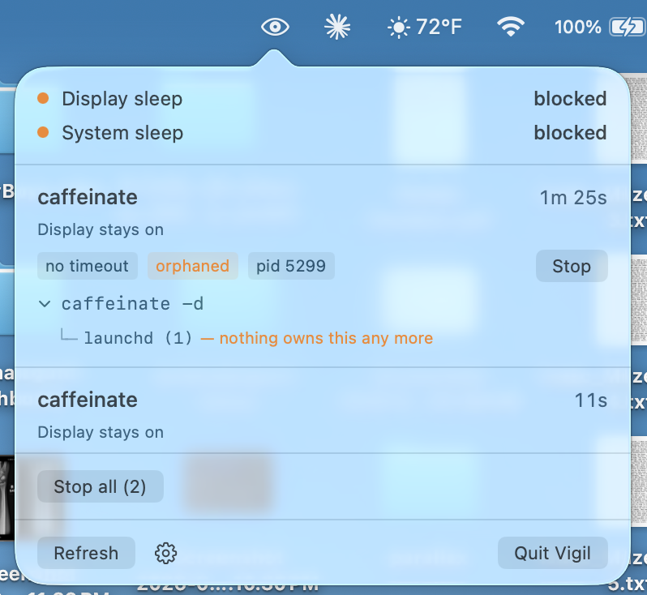

# Vigil

**A macOS menu bar app that shows what's keeping your Mac awake — and lets you stop it.**

Your Mac won't sleep. `pmset -g assertions` tells you a `caffeinate` process has
been holding an assertion for fourteen hours. It doesn't tell you what started
it, whether that thing is still running, or how to get rid of it without hunting
for the PID.

Vigil does.



## What it does

- Lists every power-management assertion, longest-held first
- Separates the things actually blocking sleep from the OS background noise
- Shows the **full command line** — `caffeinate -d -t 600`, not just `caffeinate`
- Shows the **parent chain**, so you can tell a running build from leftover debris
- Flags anything **orphaned** to launchd, or blocking for over an hour
- Stops one process, or all of them, from the menu bar

## Why the parent chain matters

These two look identical in `pmset`:

```
caffeinate -d -w 4471          caffeinate -d
  └─ make (4470)                 └─ launchd (1) — nothing owns this any more
      └─ zsh (4402)
          └─ Terminal (1180)
```

The first is a build in progress; leave it alone. The second is what's left
after a parent crashed or was force-quit, and it will hold its assertion until
you reboot. Vigil tells them apart.

## Install

Download the latest `.dmg` from [Releases](../../releases), open it, and drag
Vigil to Applications. It's signed and notarized, so it opens without a
Gatekeeper detour.

To have it start automatically: System Settings → General → Login Items → **+**
→ `/Applications/Vigil.app`.

**Requirements:** macOS 13 or later. Developed and tested on macOS 26 / Apple
Silicon; Intel is untested and the build is currently arm64-only.

## Build from source

Requires [XcodeGen](https://github.com/yonaskolb/XcodeGen) (`brew install xcodegen`).

```
make run     # generate the project, build, launch in the foreground
make build   # build only
make clean
```

`make run` keeps the process attached to the terminal, which is what you want
while developing — `NSLog` output lands there and Ctrl-C quits.

Two targets manufacture the cases worth testing:

```
make demo-orphan       # a parentless caffeinate with no timeout — should flag orange
make demo-assertion    # prints the command for the well-behaved contrast case
```

Producing a genuine orphan is fussier than it looks. `nohup caffeinate -d &`
followed by `disown` does *not* work — `disown` only drops the job from the
shell's table, the parent stays alive, and the process never reparents. A
short-lived intermediate shell does it: the shell exits the moment it has
spawned the child, and the kernel hands the orphan to launchd.

## Icon

The artwork is a vector master at `icon/vigil-icon.svg`, rendered to
`icon/Vigil.iconset` at all ten sizes macOS asks for. `make icon` compiles that
into `Sources/Resources/Vigil.icns` with `iconutil`, which ships with macOS —
a normal build needs nothing installed.

Each size is rendered from the vector at its true size rather than downsampled
from 1024, which is what keeps the 16 and 32px versions legible. If you edit the
SVG, run `scripts/render-icon.sh` to regenerate the PNGs; that step needs
`librsvg` or `cairosvg`.

## Uninstall

Gear menu → **Uninstall Vigil…**. It deletes its preferences and moves itself to
the Trash. `scripts/uninstall-vigil.sh` does the same from the command line, for
when the app is already gone and its preferences aren't.

## How it works

### Classification

Every assertion lands in one of two buckets:

| Bucket | Meaning | Shown | Stoppable |
|---|---|---|---|
| **blocking** | Prevents sleep and owned by you | Top level | Yes |
| **system** | Root-owned, denylisted, or doesn't prevent sleep | Background | No |

A raw assertion dump is mostly noise. `powerd`'s *"Prevent sleep while display
is on"* looks alarming and is purely downstream — it exists because something
else is holding the display awake, and releases the moment that clears. Same for
`WindowServer`'s `UserIsActive` (you, typing) and `cloudd`'s `SystemIsActive`
(iCloud sync, self-expiring). Surfacing those next to a genuine stray teaches you
to ignore the list.

The line is drawn on **ownership**, not on whether a timeout exists. A
`caffeinate -d -t 600` is blocking sleep for the next ten minutes whether or not
it eventually cleans up after itself, so it belongs at the top with a Stop
button. The timeout shows as a tag on the row instead.

### Where the data comes from

`IOPMCopyAssertionsByProcess` and `IOPMCopyAssertionsStatus` for the assertions.
`sysctl(KERN_PROC_PID)` for ppid, uid and start time. `KERN_PROCARGS2` for the
executable path and argv — parsed by hand, since the buffer packs `argc`, the
exec path, alignment nulls, then the arguments.

The orphan check uses the exec path rather than `argv[0]`, because `argv[0]` is
whatever the caller chose to put there: a tool run from a shell reports a bare
`caffeinate` while an app reports a full path. Bundled applications are excluded
from the check entirely — every app launched from the Dock is a direct child of
launchd by design, so without that exclusion the flag would fire on everything
and mean nothing.

### Safety

Killing the wrong assertion holder is far worse than a Mac that won't sleep.
`ProcessTerminator` re-checks all of this itself rather than trusting the UI to
have disabled the button:

- Refuses anything with `uid == 0`
- Refuses a name denylist regardless of owner: `powerd`, `WindowServer`,
  `loginwindow`, `sharingd`, `useractivityd`, `cloudd`, `coreaudiod`,
  `bluetoothd`, `backupd`, `mds` and friends
- Refuses processes owned by another user, launchd, and Vigil itself
- **Stop all** covers only the blocking bucket, deduplicated by PID

`SIGTERM` first, two-second grace period, `SIGKILL` only if the PID is still
there.

### Refresh

Registers for the Darwin notification power management posts when the assertion
set changes, with a polling timer as a fallback. The interval is set from the
gear menu — 2 seconds through 5 minutes, or **Only when opened** for no polling
at all.

What that governs is narrower than it looks: the popover refreshes on open, so
the list you read is always current. The interval only controls how fast the menu
bar icon reacts while the popover is closed.

### Undocumented surface

Three things here aren't in the public SDK, and each degrades one feature rather
than breaking the app:

1. **Assertion dictionary keys.** IOPMLib.h defines them as `CFSTR(...)` macros,
   which don't import into Swift, so `AssertionKey` reproduces the literals with
   fallbacks. If durations read blank on your system, that's the creation-date
   key — check `/usr/include/IOKit/pwr_mgt/IOPMLib.h` and add it.
2. **The change notification name** comes from IOPMLibPrivate.h. If it doesn't
   fire, the polling timer covers it.
3. **`KERN_PROCARGS2`** returns nothing for other users' processes. Those rows
   fall back to the 16-character `p_comm` name — and they aren't stoppable anyway.

If you hit any of these on a version of macOS I haven't tested, please open an
issue; that's most of what I'd want to know.

## Distribution

```
make dist             # signed app, notarized, as both .zip and .dmg
make install-signed   # install the signed build without rebuilding it
```

The disk image is signed and notarized in its own right — notarizing the app
inside isn't enough, because a downloaded `.dmg` carries its own quarantine flag
and Gatekeeper checks the image first.

There's no `.pkg`. It would need a second certificate, its own notarization, and
an admin password, all to copy one bundle into `/Applications`. Vigil writes
nothing outside its own bundle except a preferences plist.

## Not implemented

- Launch at login from within the app (`SMAppService`)
- A user-managed ignore list for apps that legitimately hold assertions
- Assertion history — "what kept my Mac awake last night" after the fact
- Universal binary
- `ProcessTerminator` blocks the main thread for up to two seconds between
  SIGTERM and SIGKILL

## License

MIT
